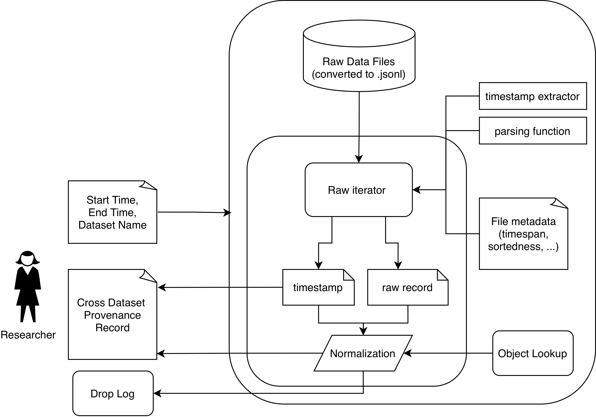
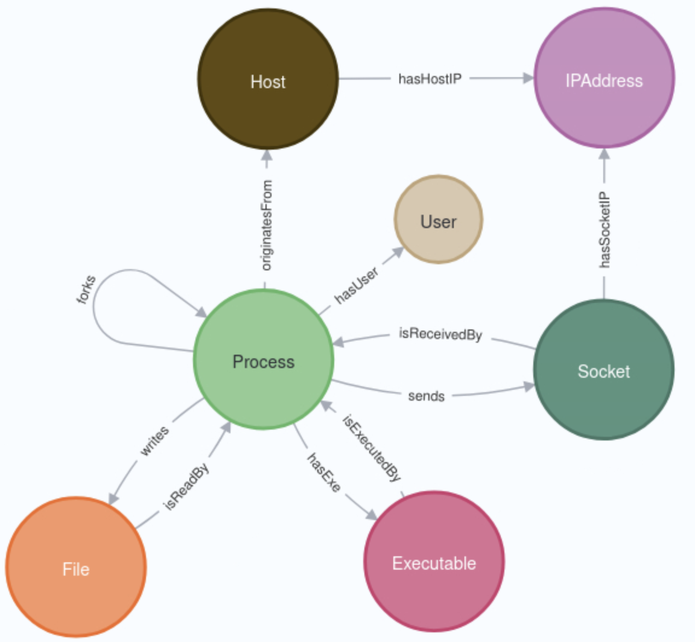

# Provenance Benchmark Explorer

Benchmark characteristics deserve closer scrutiny when interpreting PIDS detection performance; this repository is the environment used to deep dive into those benchmarks.

The datasets are large (>10 TB uncompressed), use heterogeneous data models, and contain a fair amount of errata. Working with them benefits from a compute cluster — the setup notes target [GWDG's Unified HPC System](https://docs.hpc.gwdg.de/), but this reflects only in environment variables.

## Two core components

**Common provenance record schema and iterator.** 
Normalizes all E3, E5, and OpTC onto a single schema (Process, Executable, File, Socket, plus IP-Address/Host/User nodes and information-flow edges). 
Records are validated against UUID-typed object lookups (with a SQLite + LRU fallback for larger-than-memory cases), and excluded records are logged with reasons. See `src/provenance_explorer/common_record/`.

**Neo4j-backed interactive exploration.** 
Spins up time-scoped Neo4j instances (one Apptainer container per attack-window slice) with range indexes on event timestamps and lookup indexes on UUIDs. 
An annotator maps external label sets (ThreaTrace, PIDSMaker, ...) onto the common record's UUIDs so attack events can be located and explored via Cypher. See `src/provenance_explorer/neo4j_graph/` and `scripts/explore_graph.py`.

On top of these, the repository contains the analysis code behind an accompanying masters thesis's quantitative and exploratory results across four dimensions: Provenance Capture, System Scale, Activity Realism, Threat Coverage.
Found under `src/provenance_explorer/analysis/`, together with the notebooks and scripts connecting everything.

## Where to look next

- [`setup.md`](setup.md) — environment setup on the HPC cluster, workspace reservation, and how to download and extract the raw DARPA data.
- [`components.md`](components.md) — module-by-module tour of the package, scripts, and notebooks.