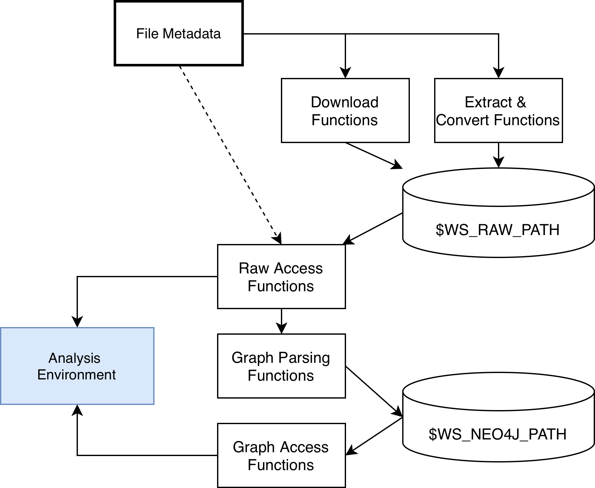

# Setup on GWDG HPC Cluster

Due to the size of the involved benchmarks, this environment is developed for use on compute clusters, namely the unified HPC system at [GWDG](https://docs.hpc.gwdg.de/index.html). 
Besides the initial storage reservation and setup of Neo4j with apptainer, this repository is intended to work universally.
Documentation of the different available workspaces at the GWDG HPC can be found [here](https://docs.hpc.gwdg.de/how_to_use/storage_systems/workspaces/index.html).

## Overview

The data storages and functions in this repository are structured as such: 


## Environment Setup

### Conda Environment Creation

```bash
module load miniforge3/24.3.0-0
conda env create -f environment.yml
conda activate provenance-explorer
```

The environment installs the repository itself in editable mode so the provenance_explorer package is importable.

### Workspace Reservation

Extension of the below workspaces beyond 30 days is done with `ws_extend raw <days>` (or `ws_extend neo4j <days>`).

```bash
# Allocate workspace for raw & neo4j data with expiration of 30 days & add as env variables
export WS_RAW_PATH=$(ws_allocate -F ceph-ssd -r 3 -m <example>@stud.uni-goettingen.de raw 30)
export WS_NEO4J_PATH=$(ws_allocate -F ceph-ssd -r 3 -m <example>@stud.uni-goettingen.de neo4j 30)

# so the paths will be defined when activating provenance-explorer in the future
echo "export WS_RAW_PATH=$WS_RAW_PATH" >> $CONDA_PREFIX/etc/conda/activate.d/ws_vars.sh
echo "export WS_NEO4J_PATH=$WS_NEO4J_PATH" >> $CONDA_PREFIX/etc/conda/activate.d/ws_vars.sh
```

### Downloading & Extracting the Raw DARPA Data

#### Google Drive Setup

Requires browser interaction and thuis is not run on the cluster. 
Downloads require GDrive API access. This is done via Google Cloud, 
1. by making a new project, e. g. "gdrive-downloader"
2. then enabling gdrive api access, 
3. adding your gmail as a test user
4. adding a desktop client under `APIs and Services > Credentials > Create Credentials` and download the client ID & Secret as .json
5. Following the below steps on your machine. 

##### 1. Get tokens

```bash
pip install google-auth-oauthlib
```

Replace the client ID/secret with your own from the Google Cloud Console, 
then run below snippet. 
A browser window will open. 
Sign in and grant read access.

```python
from google_auth_oauthlib.flow import InstalledAppFlow

flow = InstalledAppFlow.from_client_config(
    {"installed": {
        "client_id": "<YOUR_CLIENT_ID>",
        "client_secret": "<YOUR_CLIENT_SECRET>",
        "auth_uri": "https://accounts.google.com/o/oauth2/auth",
        "token_uri": "https://oauth2.googleapis.com/token",
    }},
    scopes=["https://www.googleapis.com/auth/drive.readonly"],
)
creds = flow.run_local_server(port=0)

import json, pathlib
pathlib.Path("gdrive_token.json").write_text(creds.to_json())
print("Saved gdrive_token.json")
```

##### 2. Copy to cluster

```bash
scp gdrive_token.json <you>@<your_cluster>:~/.gdrive_token.json
```

The download scripts will refresh tokens automatically from here.

#### Downloading & Extracting

The download & extract script is idempotent, so it will check which target files are already there and only do additional downloads / extractions.
For Engagement 3 and OpTC, `run_download.py` will download the considered files from the corresponding gdrive folders and extract them.
```bash
python run_download.py --only e3
python run_download.py --only optc
```

For Engagement 5, extracting is more complicated, as the files come in binary AVRO format. 
Generic python avro-tools do not emit UUIDs in proper format and handle the CDM union types incorrectly.
Therefore the java consumer shipped with the dataset needs to be used.
Since the GWDG cluster does not have maven, some necessary consumers need to be buitl somewhere else(locally) and scp'ed to the cluster.

LOCALLY (requires gdown, maven and java installed): 
```bash
gdown 1g1lgTa10d_CvVUpAAvBFJ_4qEbywctKV
tar -xvf ta3-java-consumer.tar.gz
cd ta3-java-consumer

# jdk >=21 dropped support java 7, so this needs to be adjusted 
for d in ta3-serialization-schema tc-bbn-avro tc-bbn-kafka; do
    sed -i '' 's|<source>1.7</source>|<source>1.8</source>|g; s|<target>1.7</target>|<target>1.8</target>|g' "$d/pom.xml"
done

cd ta3-serialization-schema && mvn clean exec:java && mvn install && cd ..
cd tc-bbn-avro && mvn clean install && cd ..
cd tc-bbn-kafka && mvn assembly:assembly && cd ..
```

and move the built files to `$WS_RAW_PATH/.tools` 

LOCALLY, in `ta3-java-consumer`: 
```bash
scp tc-bbn-kafka/target/kafkaclients-1.0-SNAPSHOT-jar-with-dependencies.jar <your_user><cluster>:<$WS_RAW_PATH>/.tools/bbn-consumer.jar
scp ta3-serialization-schema/avro/TCCDMDatum.avsc <your_user><cluster>:<$WS_RAW_PATH>/.tools/TCCDMDatum.avsc
```

Then, also Engagement 5 can be extratced (with more than one worker preferably, as this takes a while): 
```bash
python run_download.py --only e5 --workers 8
```